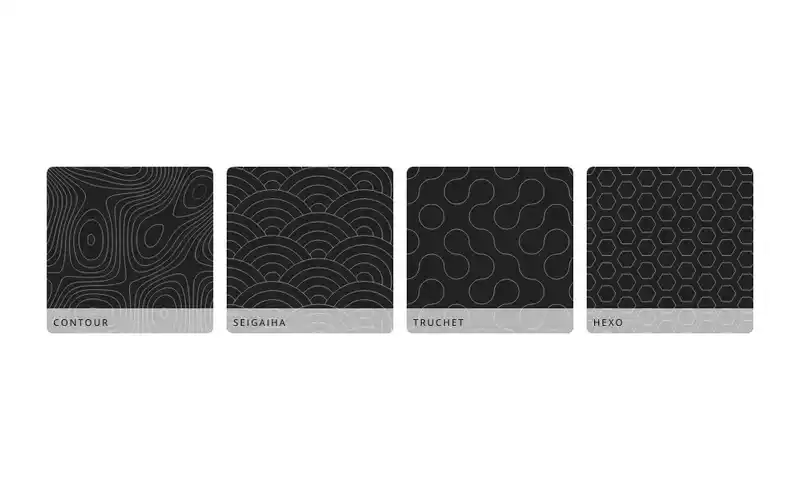

# Paintlets

## What this is

This is a playground for experimentation with using Houdini APIs to create CSS Paintlets.

"Paintlets" are effectively canvas-in-CSS and can be used anywhere that images are supported: backgrounds, borders, etc.

## How it works

In a local context the paintlets are imported via Vite's ability to define the way a module is loaded: by applying the query strings `?worker&url`.

In production one would load them as an npm module (once they're released!)

## Development

This is a monorepo comprising 2 workspaces:
1. `/paintlets`: The paintlet definitions
2. `/website`: The Astro-powered website showcasing them

To develop locally run `npm start` in the root of the project: this will serve the Astro app that imports the paintlets and makes them available to the browser.

## Production

To release please ensure that you run
1. `npm run build`
2. `npm run preview`

This will let you verify that the paintlets actually display correctly!

## TODO

- [ ] Release as npm module(s)
- [ ] Use Playwright in a pre-commit hook to test against a visual snapshot in order to guard against regressions (will need pre-configured seed values to ensure deterministic output)
